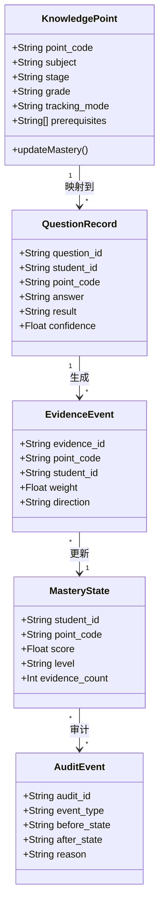

# 数据模型总览

> [!info] Phase3 目标
> 本阶段把课标知识体系转换成统一可追踪的数据对象、状态流转和审计规则，为照片录入、手动录题、BKT 更新和结果回写提供稳定底座。

## 当前结构

- [[核心对象字典]]
- [[事件流转规范]]
- [[掌握状态定义]]
- [[审计日志规范]]
- [[题目记录模板]]
- [[证据强度分级]]
- [[掌握度更新规则]]
- [[回写规范]]
- [[闭环示例]]

## 关键对象

- `KnowledgePoint`：知识点定义与归属
- `QuestionRecord`：题目与作答记录
- `EvidenceEvent`：一次可用于追踪的证据事件
- `MasteryState`：知识点掌握状态
- `AuditEvent`：变更与模型调用审计

## 本阶段交付要求

1. 对象字段和中文外显规则明确。
2. 掌握状态的更新原则明确。
3. 事件流转能覆盖导入、分析、复核、回写。
4. 审计日志足以支持后续软著和问题排查。
5. 有一条可复用的最小闭环示例。
