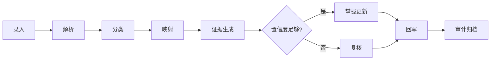

# 事件流转规范

## 流转主链路

> 文字描述：`录入 -> 解析 -> 分类 -> 映射 -> 证据生成 -> 掌握更新 -> 回写 -> 审计`

## 流程图

## 事件类型

- `ingest`：接收照片或手动录题
- `parse`：OCR/文本清洗/题目切分
- `classify`：学科、题型、难度初判
- `map`：题目到知识点映射
- `evidence`：形成可追踪证据
- `update`：更新掌握状态
- `review`：人工复核
- `rollback`：人工修正后回滚或重算
- `export`：回写到 Obsidian 视图或导出结果

## 事件原则

1. 任何掌握状态变化必须有对应证据事件。
2. 低置信度结果必须进入复核，不得静默写入。
3. 回写前后必须保留审计事件。
4. 同一题目多次分析时，保留最新有效版本和修正历史。

## 中文展示规则

- 事件名称、说明和状态展示优先使用中文。
- 英文字段仅用于内部流转和系统对接。

