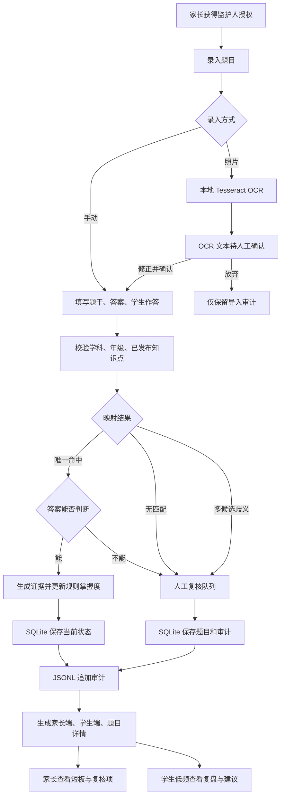
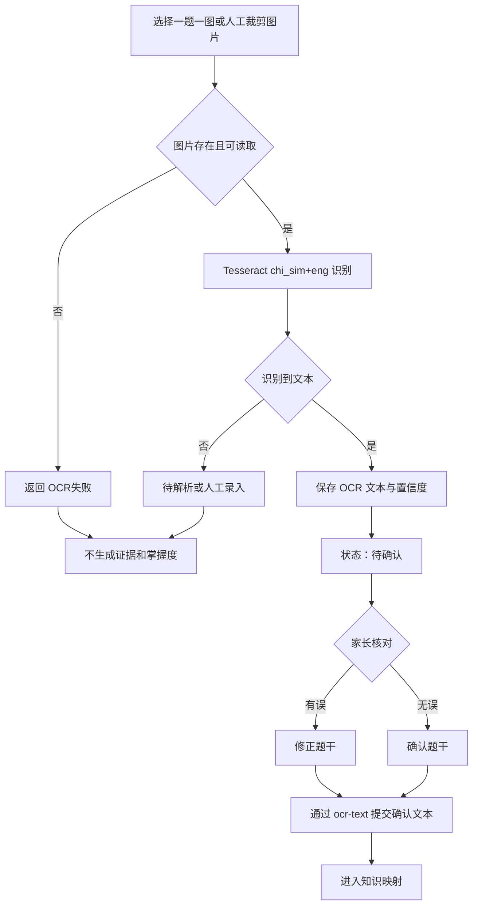
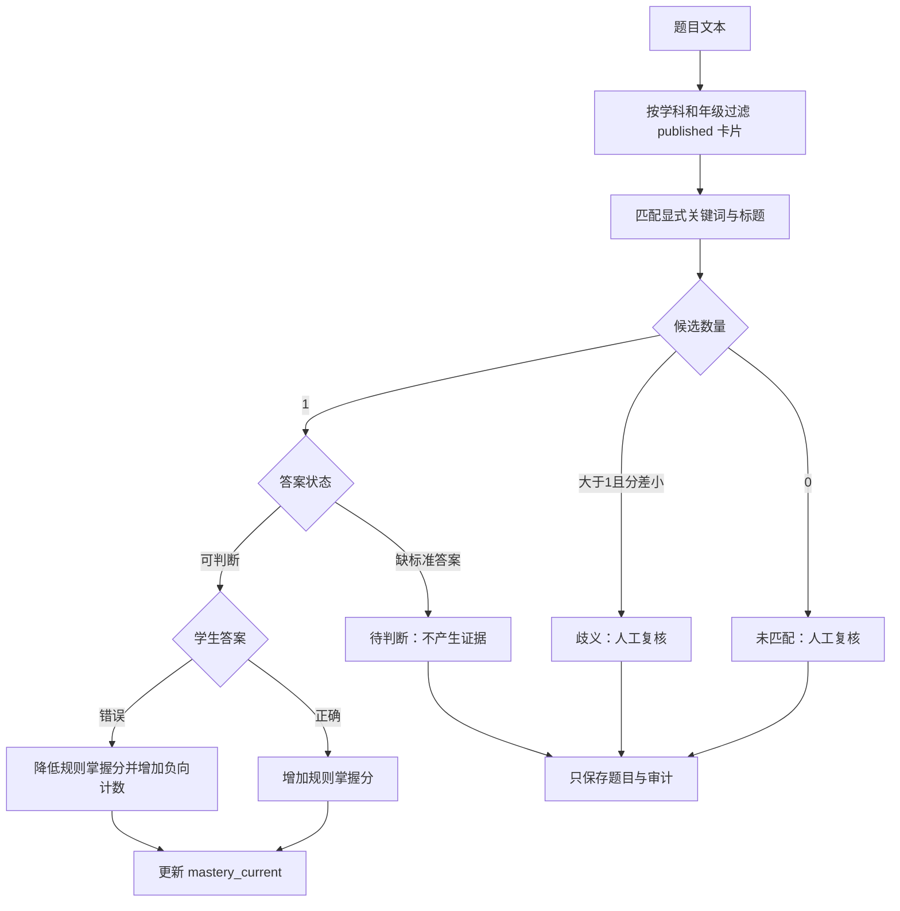
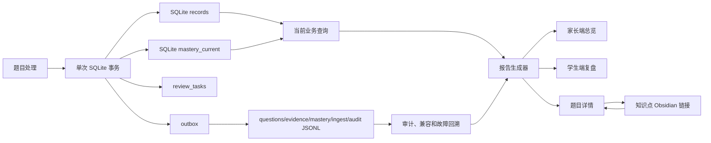
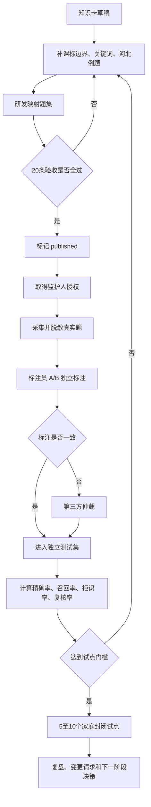

# 全流程模拟与流程图

## 模拟结论

2026-07-11 使用临时 Vault 执行 13 条端到端流程，正式学生日志未被修改。结果为 13 条通过、0 条失败。

| 流程 | 结果 | 核心断言 |
| --- | --- | --- |
| 手动录题正确 | 通过 | 生成 `rule-v2` 证据和掌握状态 |
| 手动录题错误 | 通过 | 负向证据累计一次 |
| 答案缺失 | 通过 | 只写题目和审计，不写证据与掌握度 |
| 未知知识点 | 通过 | 拒识并进入人工复核 |
| 多知识点歧义 | 通过 | 不更新掌握度 |
| 人工复核写入 | 通过 | 人工结论生成审核证据 |
| 真实 OCR | 通过 | Tesseract 输出后进入待确认 |
| OCR 人工确认 | 通过 | 确认文本进入分析 |
| 图片不存在 | 通过 | 返回 OCR 失败，不写掌握度 |
| 报告生成 | 通过 | 生成家长端、学生端和题目详情 |
| SQLite 与 JSONL | 通过 | 当前状态与追加审计均有记录 |
| 复核任务汇总 | 通过 | 待确认、待判断、拒识和 OCR 失败可统一统计 |
| 数据库版本 | 通过 | `schema_version=1` |

执行命令：`python3 scripts/run_flow_simulation.py`

## 一、业务主流程

## 二、照片与 OCR 支流程

## 三、映射、复核与掌握度支流程

## 四、数据与报告支流程

## 五、测试、标注与试点支流程

## 当前未打通或需要外部条件的流程

- 整张试卷自动切题：当前建议一题一图或人工裁剪。
- 复杂公式和手写体高质量识别：当前必须人工复核。
- 已录错数据的产品化撤销与更正：当前需维护人员处理，尚无用户界面。
- 数据导出与删除操作界面：合规文档已定义，代码入口尚未实现。
- 50 道真实题和家庭试点：依赖监护人授权及真实参与者，不能在本地模拟为已完成。
- Web 家长端与学生端：当前结果载体仍为 Obsidian Markdown。

## 本次发现并修复

1. 待判断题原先会增加证据计数，现已改为只写题目和审计。
2. 模拟脚本原先不能从 `scripts/` 直接导入项目包，现已修复入口路径。
3. SQLite 与 JSONL 原先逐条非原子双写，现改为 SQLite 事务加可重试 outbox。
4. 报告原先漏算未匹配和 OCR 待确认项，现改为读取独立复核任务。
